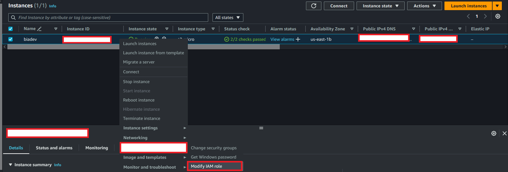
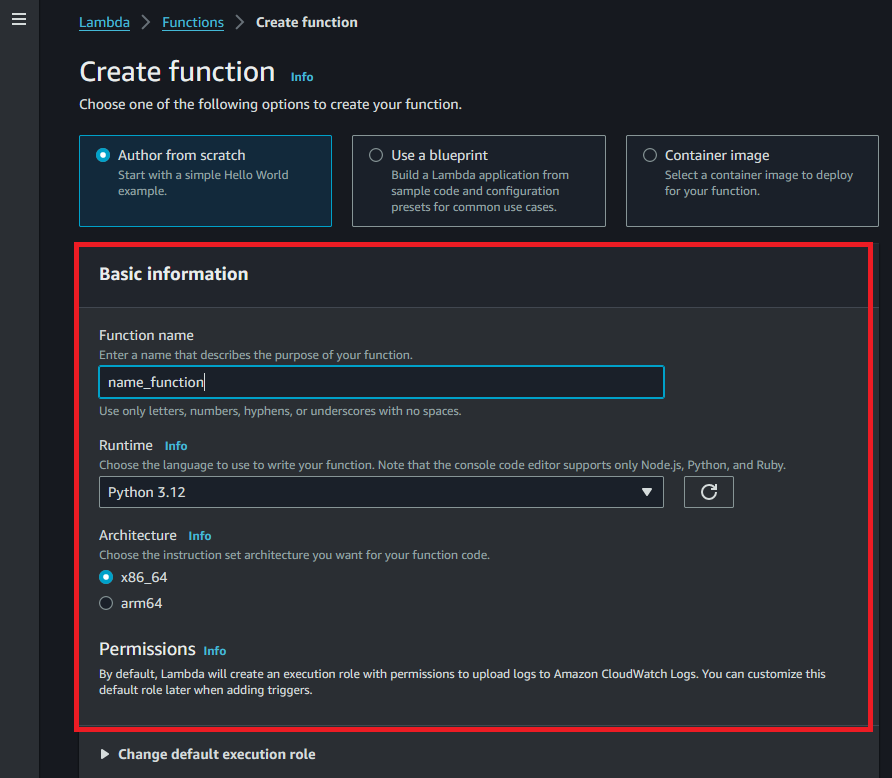
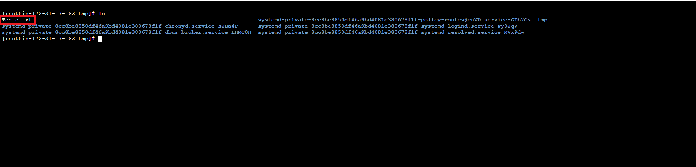

# Trigger Lambda com S3
Repositório para Auxiliar na Configuração de Trigger S3 para Lambda na AWS

Este repositório foi criado para facilitar a configuração de um trigger S3 para Lambda na AWS. Destina-se a iniciantes no uso da AWS, e com algumas leituras, será fácil realizar o teste.
Passos

Permissão IAM para sua Instância EC2:
    Verifique se sua instância EC2 possui a permissão IAM necessária. Caso contrário, é necessário criar uma role com a política adequada. Recomendamos a utilização da política AmazonSSMFullAccess. Certifique-se também de que a role da EC2 tenha permissões adequadas no S3 onde os arquivos serão copiados. No arquivo politica_s3.json, fornecemos um exemplo de política que pode ser utilizada, porém, é possível também utilizar AmazonS3FullAccess (não recomendado).

Configuração da Instância EC2:
    Acesse a instância EC2 no console AWS.
    Clique com o botão direito do mouse e selecione "Security".
    Escolha a opção "Modify IAM role".

Após a preparação do EC2, vamos criar a Lambda. Para isso, acesse o serviço de Lambda na AWS e clique em "Create Function".

Após a criação da lambda, é necessário ajustar a role da lambda para que ela tenha acesso ao S3 e ao SSM.

Para configurar a role da lambda com as permissões necessárias, você pode seguir os seguintes passos:

1. Acesse o console do AWS Lambda.

2. Selecione a função da lambda que você criou.

3. Na seção "Permissões da função", clique em "Gerenciar funções de permissões".

4. Será redirecionado para o console do IAM. Clique em "Adicionar permissões" para editar a política da role.

5. Na seção "Políticas de permissão", clique em "Anexar políticas existentes".

6. Na caixa de pesquisa, digite "AmazonS3FullAccess" e selecione a política "AmazonS3FullAccess" que é responsável por conceder acesso completo ao S3.

7. Clique em "Próximo: Revisar" e, em seguida, em "Anexar política" para salvar as alterações.

8. Repita os passos 5 a 7 para adicionar a política "AmazonSSMFullAccess" que concede acesso completo ao SSM.

Após configurar a role da lambda com as permissões necessárias, você pode construir o código da lambda com base na lógica necessária para o seu objetivo.

No seu caso, em que você deseja copiar um arquivo do S3 e enviá-lo para uma pasta no EC2, você pode usar o arquivo lambda_function.py como base que deixei no github.

Agora com a Lambda já criada vamos criar uma trigger S3, na pagina da lambda vamos clicar em trigger e escolher S3.

Após selecionar você deve escolher como o trigger vai funcionar. Lembrando que a logica que buscar o arquivo no S3 deve ser feita no codigo que vai escrever, a trigger é para iniciar a lambda feita.

Na página da função Lambda, adicione um gatilho S3 e personalize suas configurações de acordo com suas necessidades:

Escolha entre os diversos tipos de eventos S3 disponíveis, como

ObjectCreated (All),
ObjectCreated (Put),
ObjectCreated (Post),
ObjectCreated (Copy),
ObjectCreated (Complete Multipart Upload),
ObjectRemoved (All),
ObjectRemoved (Delete),
ObjectRemoved (DeleteMarkerCreated).

Após todas a configurações devemos ter uma tela proxima a essa:

Ao colcoar um arquivo dentro do s3 devemos ter uma resposta positiva, no meu caso eu cliquei em teste para validar o funcionamento da lambda.

E em nosso EC2 devemos ter o arquivo copiado do S3:

Aqui é um exemplo de como podemos configurar e testara as triggers tem diversas aplicabildiades e essa é somente uma das muitas.